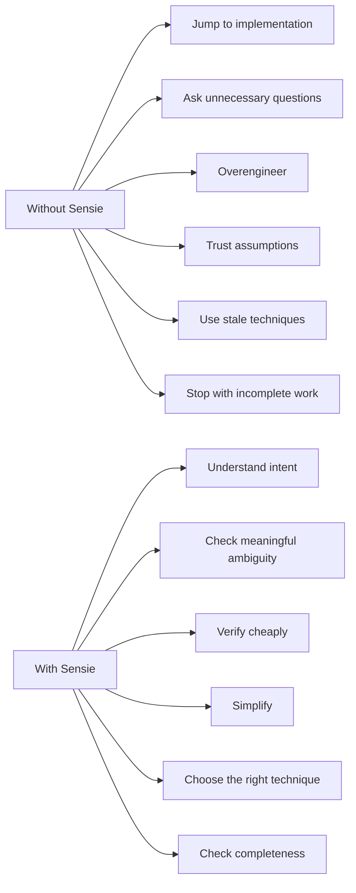
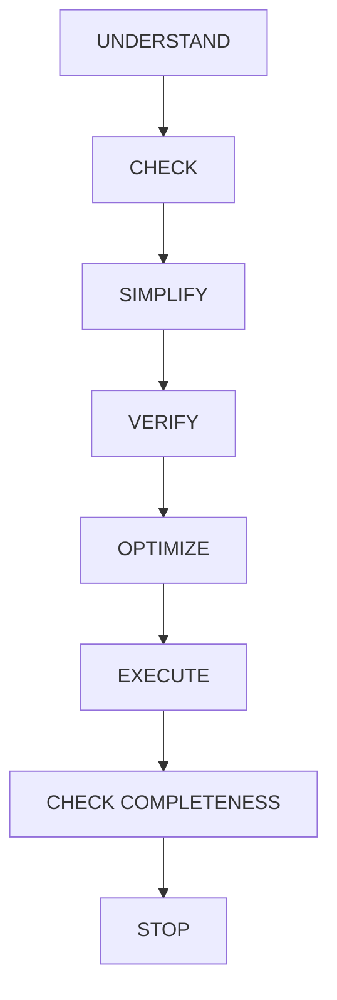
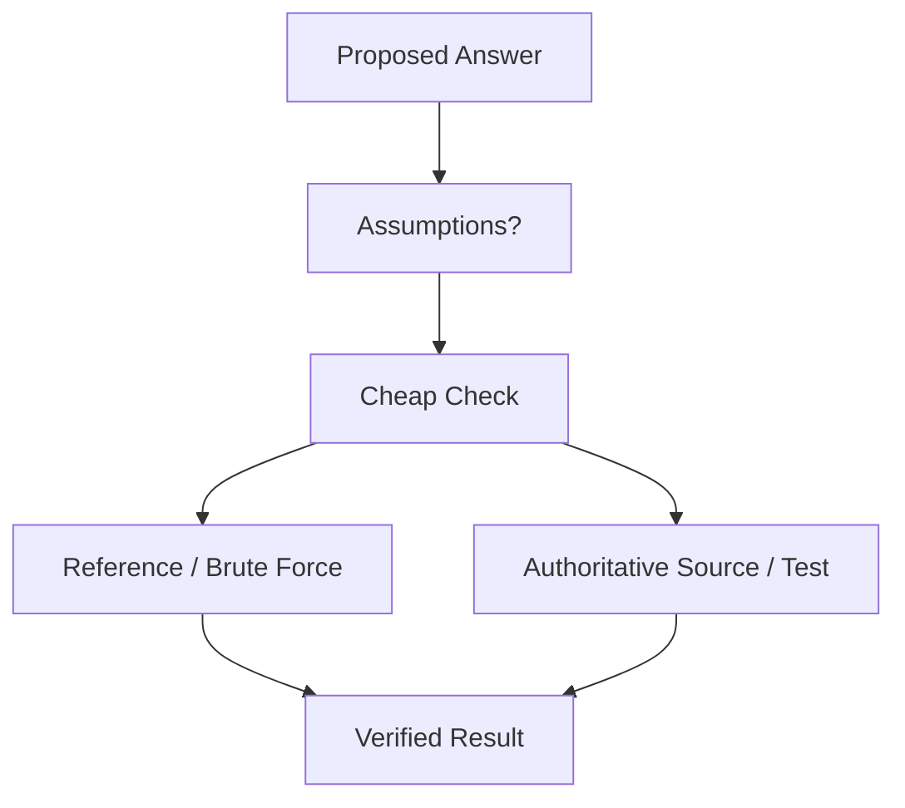
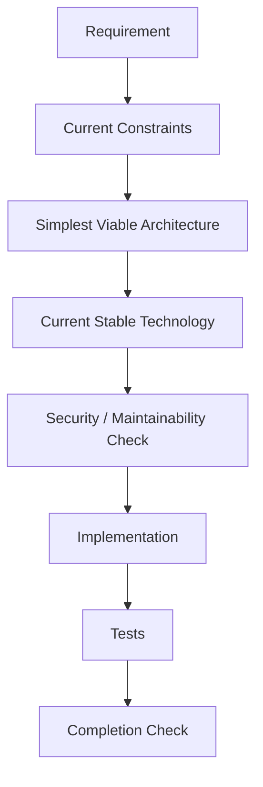
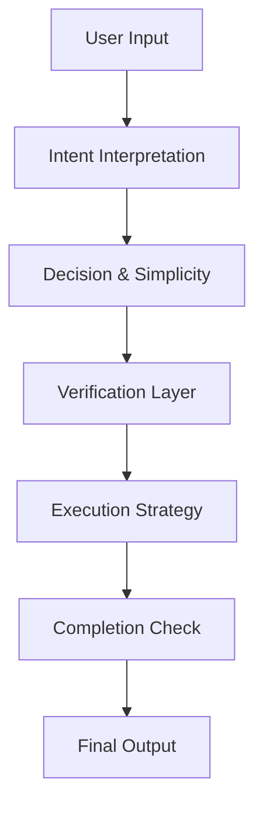

# Sensie

**Practical Intelligence for LLMs**

Sensie is a reasoning discipline for LLMs and AI agents. It sits between a user's request and execution, helping an AI understand intent, avoid unnecessary effort, verify assumptions, choose appropriate techniques, and deliver complete results efficiently.

> **Sensie is not a model, chatbot, or framework. It is a reasoning skill layer.**

---

## What Sensie Solves

LLMs can produce answers that are syntactically valid and technically plausible while still being practically wrong: solving the wrong problem, asking needless questions, using stale techniques, overengineering a simple requirement, or stopping before the requested work is complete.

Sensie adds a practical decision layer:

```text
User Intent
     ↓
Reasoning
     ↓
Verification
     ↓
Execution
     ↓
Completion
```

| Correctness layer | Question |
|---|---|
| Syntactic | Is the output well-formed? |
| Technical | Does it technically work? |
| Practical | Is it an appropriate solution? |
| Intent | Does it actually satisfy the user's goal? |

---

## Before Sensie vs After Sensie



---

## The Sensie Reasoning Loop



### 01 — Understand
Infer the real outcome the user needs, not only the literal surface wording.

### 02 — Check
Identify ambiguity, assumptions, constraints, dependencies, and risk. Ask only when the missing information materially changes the result.

### 03 — Simplify
Prefer the smallest solution that satisfies the actual requirement. Avoid unnecessary abstractions, dependencies, and architecture.

### 04 — Verify
Use a proportionate check: execution, tests, reference implementations, brute-force comparisons, or authoritative sources when they meaningfully improve confidence.

### 05 — Optimize
Choose an appropriate production technique rather than blindly shipping the first workable approach. Optimize for correctness, maintainability, performance, and current support as the task requires.

### 06 — Execute
Perform the work using the selected approach.

### 07 — Check Completeness
Confirm that every requested deliverable is present, coherent, and usable.

### 08 — Stop
Do not create unnecessary follow-up work after the requested objective is complete.

---

## The Sensie Principles

### 01 — Understand Before Acting
Determine the real objective before choosing an implementation.

### 02 — Ask Only When It Matters
Do not interrupt the user for information that can be safely inferred.

### 03 — Verify Cheaply
Use the lowest-cost verification that materially increases confidence.

### 04 — Simple Is a Feature
Complexity must be justified by the problem.

### 05 — Brute Force Is a Validator
Brute force is often excellent for reference solutions, edge-case checks, and differential testing. It does not automatically belong in production.

### 06 — Current Beats Stale
When freshness matters, prefer currently supported and appropriate techniques over deprecated practices.

### 07 — Correctness Before Cleverness
A sophisticated solution is not better when a simpler one is more reliable.

### 08 — Complete Means Complete
Do not stop at partial code, missing files, or unverified assumptions.

### 09 — Challenge Bad Assumptions
Do not blindly agree with a materially incorrect or suboptimal approach.

### 10 — Stop When the Goal Is Done
Avoid needless work after the requested outcome has been satisfied.

---

## Verification Engine

Verification intensity should scale with uncertainty and impact.



| Verification level | Typical use |
|---|---|
| Quick | Simple, low-risk questions |
| Standard | Normal coding and reasoning |
| Strict | Important engineering decisions |
| Maximum Practical | High-impact or highly uncertain work |

Sensie does **not** claim impossible absolute accuracy. The objective is maximum practical accuracy through verification, testing, source checking, and explicit uncertainty handling.

---

## Brute Force as a Practical Tool

> Brute force is not inherently bad code. It is often an excellent reference solution.

Consider **Two Sum**.

### Reference implementation

```python
def two_sum_bruteforce(nums, target):
    for i in range(len(nums)):
        for j in range(i + 1, len(nums)):
            if nums[i] + nums[j] == target:
                return [i, j]
    return []
```

### Production-oriented implementation

```python
def two_sum(nums, target):
    seen = {}
    for i, value in enumerate(nums):
        needed = target - value
        if needed in seen:
            return [seen[needed], i]
        seen[value] = i
    return []
```

The brute-force version provides an independent reference against which the optimized version can be tested.

### Differential testing

```python
import random

for _ in range(10_000):
    nums = [random.randint(-20, 20) for _ in range(random.randint(0, 15))]
    target = random.randint(-20, 20)

    expected = two_sum_bruteforce(nums, target)
    actual = two_sum(nums, target)

    assert (
        (not expected and not actual)
        or (
            len(actual) == 2
            and actual[0] != actual[1]
            and nums[actual[0]] + nums[actual[1]] == target
            and nums[expected[0]] + nums[expected[1]] == target
        )
    )
```

This illustrates the distinction between **verification strategy** and **production strategy**.

---

## Software Engineering Mode

When the task is project development, Sensie uses a practical engineering sequence:



| Problem detected | Sensie response |
|---|---|
| Deprecated API | Prefer a currently supported alternative |
| Unnecessary dependency | Remove or avoid it |
| Overengineering | Simplify the design |
| Missing validation | Add appropriate validation |
| Unclear requirement | Infer when safe; ask when high-impact |
| Security risk | Prefer secure defaults and least privilege |
| Incomplete implementation | Continue until the agreed goal is complete |
| Unsupported claim | Verify before stating it |

---

## Architecture



Sensie is best understood as a **decision layer**, not an application runtime. The repository contains the skill specification and supporting validation material; an LLM or agent remains responsible for actual execution.

---

## Practical Examples

### Coding

**Without Sensie:** immediately creates a complex architecture.

**With Sensie:** identifies the requirement, constraints, and expected scope, then chooses the smallest suitable architecture.

### Ambiguity

**Without Sensie:** asks several clarification questions for details that do not materially affect the answer.

**With Sensie:** makes a safe inference and proceeds when the consequence is low.

### Algorithms

**Without Sensie:** ships an optimized implementation without independent checking.

**With Sensie:** compares an optimized implementation against a simpler reference solution where that check is cheap and useful.

### Current technology

**Without Sensie:** recommends an old API because it is familiar.

**With Sensie:** checks the current supported approach when freshness affects correctness or maintainability.

### Completion

**Without Sensie:** provides half of the requested implementation and stops.

**With Sensie:** checks requested files, behavior, tests, and deliverables before stopping.

---

## What Sensie Is Not

Sensie is **not**:

- a foundation model
- a replacement for domain expertise
- a guarantee of factual correctness
- a justification for over-testing trivial tasks
- a requirement to use brute force in production
- permission to ignore explicit user instructions
- a substitute for authoritative sources in high-stakes domains

---

## Configuration

The conceptual Sensie configuration is:

```text
[CS_CONFIG]
verification: standard
ask_threshold: high
optimize_project_technique: true
prefer_current_stable: true
allow_bruteforce_verification: true
verbosity: balanced
[/CS_CONFIG]
```

| Option | Meaning |
|---|---|
| `verification` | How much verification effort to apply |
| `ask_threshold` | How much ambiguity is required before asking the user |
| `optimize_project_technique` | Prefer an appropriate production technique during project work |
| `prefer_current_stable` | Prefer current, supported approaches when freshness matters |
| `allow_bruteforce_verification` | Permit brute-force/reference checks when useful |
| `verbosity` | Balance completeness with unnecessary output |

The `CS_CONFIG` name is retained for compatibility with the reasoning specification; in prose this project refers to it as **Sensie configuration**.

---

## Installation & Usage

Sensie is designed to be consumed as an LLM skill definition. A typical skill layout is:

```text
skills/
└── sensie/
    └── SKILL.md
```

The repository itself is intentionally platform-neutral. Load `SKILL.md` into an LLM or agent environment that supports instruction/skill definitions, then apply the reasoning rules before and during execution.

The project separates:

- **Skill definition** — reasoning behavior and operating rules
- **Validation utilities** — deterministic repository checks
- **Tests** — behavioral and structural acceptance checks

Sensie does not claim compatibility with a specific agent platform unless that platform is explicitly supported by the repository.

---

## Repository Structure

```text
Sensie/
├── README.md
├── SKILL.md
├── validator.py
├── tests/
│   ├── test_cases.md
│   └── test_validator.py
└── .github/
    └── workflows/
        └── validate.yml
```

> The structure above represents the intended professional project layout. Keep it synchronized with the actual repository contents as the project evolves.

---

## Validation

A mature Sensie repository should validate both structure and behavior:

- structural validation
- required-section validation
- configuration validation
- behavioral acceptance tests
- continuous-integration checks

Use commands supported by the repository's current tooling, for example:

```bash
python validator.py
pytest
```

Do not treat a passing validator as proof that the reasoning skill is universally correct; it proves only that the tested repository contracts currently pass.

---

## Accuracy Philosophy

> **Sensie does not claim impossible absolute accuracy. Its goal is maximum practical accuracy through intent inference, appropriate simplification, verification, testing, source checking, and uncertainty handling.**

**Accuracy ≠ confidence.**

A confident answer can still be wrong. Sensie therefore favors:

- verified facts
- transparent assumptions
- measured uncertainty
- reproducible checks

over fabricated certainty.

---

## Security & Engineering Safety

Sensie encourages engineering practices such as:

- secure defaults
- input validation
- avoiding secret leakage
- cautious dependency selection
- least-privilege design
- supply-chain awareness
- authoritative verification for sensitive or high-impact tasks

These principles complement—not replace—domain-specific security review.

---

## Roadmap

### Phase 1 — Core
- reasoning specification
- deterministic validation
- behavioral acceptance tests

### Phase 2 — Developer Experience
- improved examples
- CI validation
- broader test coverage

### Phase 3 — Agent Integration
- integration examples
- evaluation harnesses
- reasoning benchmarks

Roadmap items are future work unless they are explicitly implemented in the repository.

---

## Contributing

Contributions should preserve the project's central goal: **better practical decisions with less unnecessary effort, without sacrificing completeness**.

Typical workflow:

1. Create a focused branch.
2. Make the smallest justified change.
3. Add or update tests for behavioral changes.
4. Run the repository's validation suite.
5. Document meaningful behavior changes.
6. Open a focused pull request.

### Pull request checklist

- [ ] The change solves a concrete problem.
- [ ] Unnecessary complexity has been avoided.
- [ ] Relevant tests were added or updated.
- [ ] Documentation matches actual behavior.
- [ ] No unsupported claims were introduced.

---

## License

See the repository's `LICENSE` file for the authoritative license terms.

---

## Visual Language

Sensie uses **technical doodle thinking** as a visual metaphor: boxes, arrows, checkpoints, and decision paths represent the practical reasoning an AI should apply before committing to an answer or implementation.

The goal is not decoration. The goal is to make the reasoning model quickly understandable and easy to audit.

---

<p align="center">
  <strong>Sensie</strong><br>
  Practical Intelligence for LLMs
</p>
